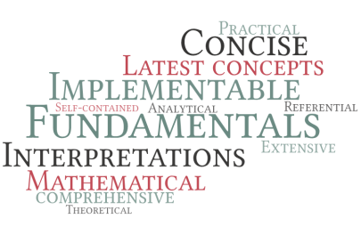

## About Machine Learning
Artificial Intelligence is the fad now. 

## About the book
A year ago, I decided to stop fooling myself that I *knew* Machine Learning and instead to learn the subject rigorously. As I started learning more concepts in-depth, my notes rapidly grew. I then decided to instead release my notes as a book so that it can be helpful to another poor soul diving into this field. I wouldn't call this an introductory book, but it is mainly to understand the concepts once you have *come across* them in MOOCs/YouTube or other places. When I showed a draft of this book to my friend, she remarked `...a book for ML research students` and that is exactly what it is. But only the readers will tell if I have really succeeded in reaching the concerned audience. 

Farrago of Concepts in Machine Learning (or FCML in short) is a book that attempts to provide an in-depth understanding of a wide range of topics in Machine learning and Deep Learning. "in-depth" here refers to the extent to which one can dive in, yet surface safely without drowning in the abyss of mathematics. This book presents a lot of insights for simpler understanding rather than the simply repeated descriptions of the same concepts across books.  I got a lot of inspiration and insights from blog posts compared to books (or maybe that's simply an effect of technology). Therefore, many abstract concepts that help unify different topics and/or provide a higher-level understanding are discussed in detail. 

People often quote Einstein for saying "If you can't explain it simply, you don't understand it well enough" but a better quote, in my opinion, is 

> Everything should be made as simple as possible, but not simpler. 

This book does NOT try to dumb-down anything. (Now that I think of it, that quote is essentially Occam's razor (read about it in the book)). 
The book is divided into 4 main parts - 
 - **Mathematics** - A wide range of mathematical concepts required to understand Machine Learning
 - **Concepts in Statistical Learning Theory** - Discusses the theoretical basis for ML models - what *learning* really means and why it works.
 - **Optimization in Machine Learning** - Deals mainly with unconstrained continuous gradient-based optimization methods.
 - **Concepts in Machine Learning** - A comphrehensive discussion of topics ranging from regression and dimensionality reduction to variational inference.
 - **Deep Learning** - Detailed discussion about Activation functions, loss functions and Neural Nets -including CNNs, RNNs, VAEs, GANs and more.
 
______

## What's inside
- Most of the mathematics required to understand and **appreciate** Machine Learning
- Description of almost all the latest and successful ML models and techniques
- Motivations and Insights that help to see the bigger picture
- Pseudo-code for 30+ popular ML/DL algorithms
- Beautiful plots (Courtsey - My friend)

## About the reader
Hey there folks of `r/MachineLearning` and `r/learnmachinelearning`! This is mainly for you. The reader may appreciate this book if she/he has some experience with Multivariable Calculus and Linear Algebra. Additionally, if the reader has some experience in programming -especially vectorization (in Languages like Python/Matlab)- it would be of great help understanding the algorithms. Ability to imagine, visualize may accelerate the reader's understanding.

If you find any incorrect information/typographical errors, please forward them to `anandkrish@gmail.com` with "INFO ERROR - FCML" or "TYPO ERROR - FCML" in the subject.

## About the author
A human with a strong passion towards Machine Learning (and a bit wiser now, I hope..).
How was my experience in writing this book, you ask? Imagine diving into the ocean, landing flat on your back, drowning in pain, surfacing and learning to stay afloat yet not knowing which direction to swim to reach the NIPS conference. I think this says all you wanna know about me.
